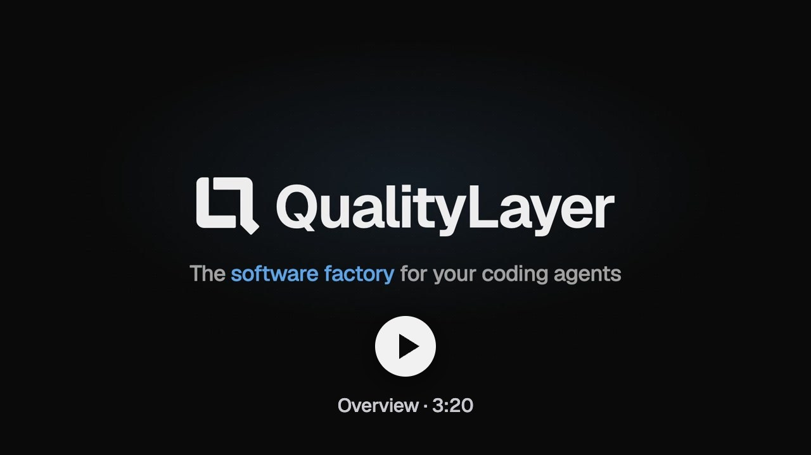
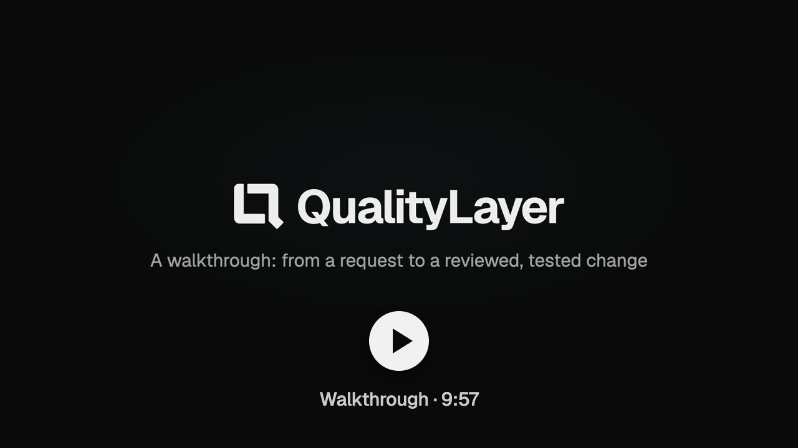
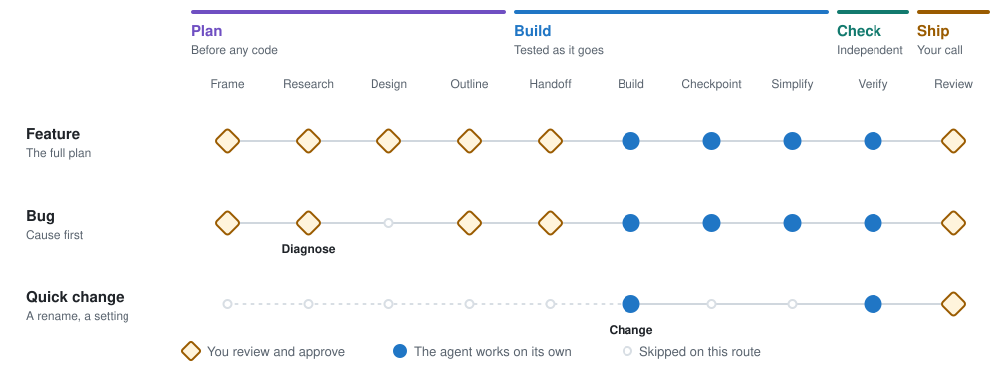
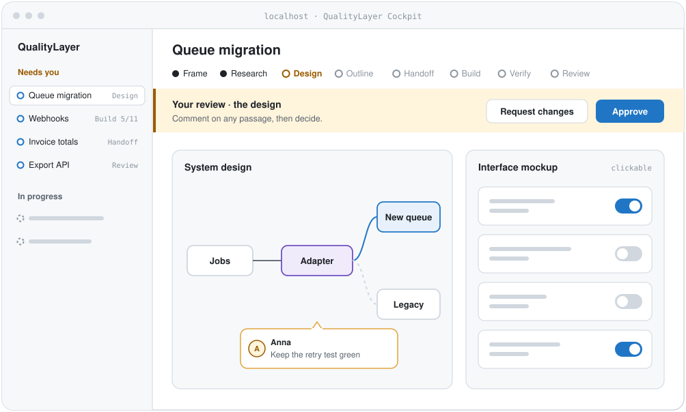
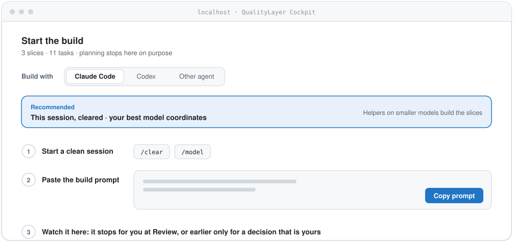

<div align="center">


# QualityLayer

### The software factory for your coding agents

You approve the plan before any code is written. Your agent builds it in small, tested slices.<br>
**Then an AI that did not write the code checks the result against what you asked for.**

[](https://github.com/maxritter/pilot-shell)
[](https://star-history.com/#maxritter/pilot-shell&Date)
[](https://github.com/maxritter/pilot-shell/releases)
[](https://github.com/maxritter/pilot-shell/pulls)

<p>
  <a href="#install">Install</a> •
  <a href="#why">Why</a> •
  <a href="#features">How it works</a> •
  <a href="#videos">Videos</a> •
  <a href="https://qualitylayer.dev/docs/">Docs</a> •
  <a href="https://qualitylayer.dev">Website</a> •
  <a href="https://github.com/maxritter/pilot-shell/releases">Changelog</a>
</p>

```bash
curl -fsSL https://qualitylayer.dev/install.sh | bash
```

**Claude Code, Codex or any agent with skills · terminal, desktop app or IDE · macOS, Linux, Windows (WSL2)**

</div>

---

<h2 id="videos">Videos</h2>

A short overview, and a walkthrough of the Cockpit.

<p>
  <a href="https://www.youtube.com/watch?v=FQuSwPxdNzk"></a>&nbsp;<a href="https://www.youtube.com/watch?v=VL3WPkWolPc"></a>
</p>

---

<h2 id="why">Why QualityLayer</h2>

**Coding agents write code fast, but even the best models don't keep a codebase healthy on their own.** Every change passes its tests and still leaves something behind: a copy, a workaround, code nobody reads. Over months, the codebase drifts into something nobody can safely change. Good software still needs people deciding what gets built, before the code exists.

**QualityLayer works alongside the agent you already use**, in the terminal, desktop app or IDE. It opens the Cockpit in your browser when there is something to see, comment on or decide:

- **See the plan before any code:** each design comes with diagrams of the system and its data, and mockups of new screens you can click through.
- **Point at what's wrong:** comment on any sentence, diagram or mockup, and your agent gets all your comments together.
- **Bring in your team early:** teammates read the plan in their own Cockpit, comment and approve it while changing it is still cheap.
- **Build in small steps:** helper agents build the change in small pieces, each starting with a failing test. A last pass removes duplicate and unused code.
- **Get results checked for you:** an AI that did not write the code runs the program and checks each point you asked for, with evidence you can open.
- **Review everything in one place:** why the change was made, the proof, how to try it and the code changes, before you open the pull request.
- **Choose who builds it:** the build works from the approved plan alone, so any agent or model can take it on.

### From Pilot Shell to QualityLayer

Pilot Shell fought the harness around your agent, with its own hooks, rules and tools. Today's models work best inside their own harness, so QualityLayer stops fighting it. It keeps what made Pilot Shell worth using, an agentic life cycle for quality, collaboration and human alignment, and puts it on top of any coding agent: one adaptive workflow in the Cockpit, team planning, a cheaper model for the build, and reviews across agents.

---

<h2 id="install">Getting started</h2>

### What you need

**A coding agent.** Any agent that supports skills and can run shell commands. The installer sets up Claude Code and Codex for you. Two features need both of them: the second review by the other vendor's AI, and messages between agent sessions.

- **Claude Code:** install with the [native installer](https://code.claude.com/docs/en/quickstart); remove an `npm` or `brew` copy first. Needs a Claude subscription: [Max 5x or 20x](https://claude.com/pricing) for one developer, [Team Premium](https://claude.com/pricing) or [Enterprise](https://claude.com/pricing) for a company.
- **Codex:** install the [Codex CLI](https://developers.openai.com/codex/cli). Needs an OpenAI subscription: [Plus or Pro](https://developers.openai.com/codex/pricing) for one developer, [Business or Enterprise](https://developers.openai.com/codex/pricing) for a company.

Start your agent once before you install, so its folder (`~/.claude` or `~/.codex`) exists.

**Terminal, desktop app or IDE.** QualityLayer works wherever your agent runs. You see the most in the terminal, where Claude Code shows the task's progress in its status line. On macOS, [Zentty](https://zentty.org/) works especially well. It keeps the planning agent, the building agent and your dev servers in separate lanes, and shows which one needs you. [Ghostty](https://ghostty.org/) and [iTerm2](https://iterm2.com/) work as well.

### Install

```bash
curl -fsSL https://qualitylayer.dev/install.sh | bash
```

This installs the `qualitylayer` command-line tool and the skill your agents use. It adds no hooks or MCP servers and leaves your shell profile alone.

<details>
<summary><b>What the installer adds</b></summary>

It downloads the binary for your platform, checks its SHA-256 checksum, then runs `qualitylayer install`, which adds:

- the binary in `~/.qualitylayer/bin/`
- the `qualitylayer` skill (and `ql`, its short form) for Claude Code and Codex, which their desktop apps and IDE extensions use too
- the `qualitylayer-peers` skill, so agent sessions can message each other
- Codex metadata so the skill runs only when you call it
- a `qualitylayer` link in `~/.local/bin` when that folder is on your `PATH`

It asks nothing. It also turns on the few agent settings QualityLayer needs, only where they are missing, and lists each one it changes. These are high reasoning effort, Claude Code's task tools, Codex's plan tool and option picker for questions (with Codex's startup notice about that picker hidden) and, when Codex knows your model's limits, its largest context window. A value you already set stays as it is.

Claude Code also gets QualityLayer's status line if you have none. Your own stays; `qualitylayer install --refresh --status-line` swaps in QualityLayer's, and uninstalling puts yours back.

```text
 platform · Opus 5 ⚡high · ◔ 12% · 140K ctx · $1.20 ·  usage-billing +2 ~1
◆ QL · ▲ review the design · design 3/8 · ✎ 1 draft comment · move API billing to usage…
```

The second line shows only while a task is running: what waits for you, the step, the build's progress and your comments.

</details>

<details>
<summary><b>Using another agent</b></summary>

Any agent that supports skills (a folder with a `SKILL.md`) and can run shell commands works. Copy `~/.qualitylayer/skill/qualitylayer` into its skills folder. At handoff, pick **Other agent** in the Cockpit to get its build prompt.

</details>

<details>
<summary><b>Update and uninstall</b></summary>

```bash
qualitylayer update               # download, verify, replace
qualitylayer uninstall            # remove exactly what install added
qualitylayer uninstall --purge    # … and the licence and task state
```

Plans in your repositories stay.

</details>

<details>
<summary><b>Install a specific version</b></summary>

To go back to an earlier release (see [releases](https://github.com/maxritter/pilot-shell/releases)):

```bash
curl -fsSL https://qualitylayer.dev/install.sh | VERSION=12.0.0-beta.1 bash
```

</details>

<details>
<summary><b>Coming from Pilot Shell 11</b></summary>

Run the installer, or let Pilot Shell 11's own updater run it. It shows one screen about the upgrade, removes Pilot Shell's tools and installs QualityLayer, without asking anything. Your licence and plans carry over.

</details>

### Your first task

Describe a change to your agent in any repository:

```text
/ql move API billing from seats to usage     # Claude Code
$ql move API billing from seats to usage     # Codex
```

Whenever something waits for you, your agent gives you the Cockpit link; `qualitylayer cockpit` opens it any time. To see how a part of your code works, ask for a picture: `/ql show me how a request reaches the ledger`.

QualityLayer runs only when you ask for it: with `/ql` or `/qualitylayer` (`$ql` or `$qualitylayer` in Codex), a build prompt from the Cockpit, or a request to resume a named task. Everything else works as before.

<details>
<summary><b>Privacy</b></summary>

Five anonymous events are sent with the daily licence check: task started, step entered, check result, task shipped, and the name of a workflow step handed out. Never a repository name, path, branch, title or text. Turn them off with `qualitylayer telemetry off` or `DO_NOT_TRACK=1`.

</details>

---

<h2 id="features">How it works</h2>

### How a request becomes a reviewed change

Describe a change to your agent. It picks one of three routes, and every step where a decision is yours waits for you in the Cockpit.

<picture>
  <source media="(prefers-color-scheme: dark)" srcset="docs/docusaurus/static/img/diagrams/routes-dark.svg">
  
</picture>

- **Feature:** before any code exists, you agree on the goal, what the code does today, the design, and the order of the build.
- **Bug:** the agent reproduces the bug and finds its cause first, then fixes it with a test.
- **Quick change:** a rename or an obvious fix goes straight to a test and the change. If it turns out bigger, the agent switches to the full plan.

QualityLayer works on the branch and worktree you have checked out and never switches them.

### Built in small pieces, each tested end to end

Your agent builds a feature in slices: thin pieces that each go through every layer, from the screen to the database. Each slice starts with a failing test, and the whole program runs before the next one starts.

**Every change ends simpler.** Once everything is built, another agent reads the whole change and cleans it up: it merges near-copies, reuses code you already have and removes what isn't needed. The behaviour stays the same. If a cleanup breaks something, the final check catches it and undoes it.

<picture>
  <source media="(prefers-color-scheme: dark)" srcset="docs/docusaurus/static/img/diagrams/slices-dark.svg">
  
</picture>

### Your agent plans with you, helper agents do the rest

Your agent plans with you on your best model. Helper agents research, build and test on smaller, cheaper models. They work from the written plan, so none of them needs your chat history. With Claude Code and Codex both installed, an AI from the other vendor also reviews the design and the finished change.

<picture>
  <source media="(prefers-color-scheme: dark)" srcset="docs/docusaurus/static/img/diagrams/agents-dark.svg">
  
</picture>

You choose the model for each job under **Subagents** in Settings, and for the other vendor's review under **Second opinion**, or turn either off.

---

<h2 id="cockpit">The Cockpit</h2>

The Cockpit is where you review and approve your agent's work. It runs on your computer and opens in your browser. Designs come with diagrams and clickable mockups; select any passage to comment, then approve or request changes.

<picture>
  <source media="(prefers-color-scheme: dark)" srcset="docs/docusaurus/static/img/diagrams/cockpit-dark.svg">
  
</picture>

### Plan with one agent, build with another

The build starts from the approved plan, not from the planning chat. You pick who builds it, and the Cockpit suggests a model, builds in the session you planned in by default, and gives you the prompt to start the build. Your best model coordinates while helpers on smaller models write the slices.

<picture>
  <source media="(prefers-color-scheme: dark)" srcset="docs/docusaurus/static/img/diagrams/handoff-dark.svg">
  
</picture>

Then follow the build as it happens. You see which agent is working, the slices being built side by side and the code changes so far. Each end-to-end check comes with screenshots and steps to try it yourself. At the end, the Review page shows the proof for each point you asked for, how to try the change and the code changes. **Create pull request** opens the pull request when you are ready. Your browser tells you whenever a task needs you.

### Review as a team

With a Team plan, your team comes in twice. **Before any code**, you share a task, and your teammates comment on the plan and approve it in their own Cockpit. People outside the team can comment through a link, without an account. Their feedback goes to your agent, and you decide.

<picture>
  <source media="(prefers-color-scheme: dark)" srcset="docs/docusaurus/static/img/diagrams/team-dark.svg">
  
</picture>

**After the build**, they review the finished change: why and how it was made, the proof, and how much code the cleanup removed. The code itself is reviewed in the pull request, as always. Open questions go back to your agent with `/ql review`, and each one ends fixed, answered or planned again.

<picture>
  <source media="(prefers-color-scheme: dark)" srcset="docs/docusaurus/static/img/diagrams/team-change-dark.svg">
  
</picture>

To get a teammate's answer, mention them with @ or choose **Ask…** on any passage. A required question holds the approval until they answer.

### Agent sessions that message each other

Claude Code and Codex sessions on your computer can message each other: Claude to Claude, Codex to Codex, or across. One can ask another for a review, hand over a task, or talk a problem through.

<picture>
  <source media="(prefers-color-scheme: dark)" srcset="docs/docusaurus/static/img/diagrams/peers-dark.svg">
  
</picture>

To try it yourself, [click through the Cockpit on the website](https://qualitylayer.dev/#cockpit) with example tasks.

---

## Documentation

- [Install](https://qualitylayer.dev/docs/install) and [your first task](https://qualitylayer.dev/docs/first-task)
- [How a task works](https://qualitylayer.dev/docs/workflow/overview): [plan](https://qualitylayer.dev/docs/workflow/plan), [build](https://qualitylayer.dev/docs/workflow/build), [check and ship](https://qualitylayer.dev/docs/workflow/check)
- [The Cockpit](https://qualitylayer.dev/docs/cockpit), and reviewing [plans](https://qualitylayer.dev/docs/team/plans) and [changes](https://qualitylayer.dev/docs/team/changes) as a team
- [Commands](https://qualitylayer.dev/docs/reference/commands), [settings](https://qualitylayer.dev/docs/reference/settings), and [files and privacy](https://qualitylayer.dev/docs/reference/files)

## Changelog

See [GitHub Releases](https://github.com/maxritter/pilot-shell/releases).

## Contributing

Found a bug or missing a feature? [Open an issue](https://github.com/maxritter/pilot-shell/issues).

## License

See [LICENSE](LICENSE).

---

<div align="center">

**The software factory for your coding agents**

Made by [Max Ritter](https://maxritter.net)

</div>

[osai-verify: 8d67182dee08d42091c5]: #
