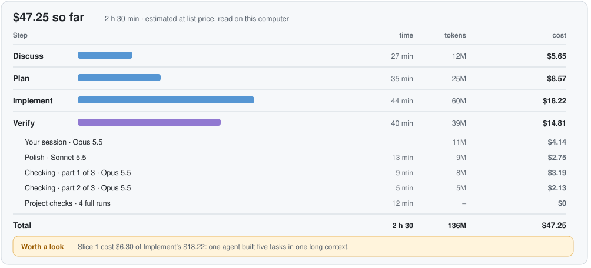

<div align="center">


# QualityLayer

### The software factory for your coding agents

You approve one plan before any code is written. Your agent builds it test first.<br>
**Then an AI that did not write the code checks the result against your request.**

[](https://github.com/maxritter/pilot-shell)
[](https://star-history.com/#maxritter/pilot-shell&Date)
[](https://github.com/maxritter/pilot-shell/releases)
[](https://github.com/maxritter/pilot-shell/pulls)

<p>
  <a href="#install">Install</a> •
  <a href="#why">Why</a> •
  <a href="#how">How it works</a> •
  <a href="#team">Teams</a> •
  <a href="https://qualitylayer.dev/docs/">Docs</a> •
  <a href="https://qualitylayer.dev">Website</a> •
  <a href="https://github.com/maxritter/pilot-shell/releases">Changelog</a>
</p>

**[Download the App](https://qualitylayer.dev/download)** for macOS, Windows or Linux. On a server, in WSL or in a container:

```bash
curl -fsSL https://qualitylayer.dev/install.sh | bash
```

**For Claude Code and Codex · terminal, desktop app or IDE · 7-day trial**

</div>

---

<h2 id="why">Why QualityLayer</h2>

**Coding agents write code fast, but even the best models don't keep a codebase healthy on their own.** Every change passes its tests and still leaves something behind: a copy, a workaround, code nobody reads. Over months, the codebase drifts into something nobody can safely change. Good software still needs people deciding what gets built, before the code exists.

**QualityLayer works inside the agent you already use.** Claude Code or Codex does the work in the terminal, its desktop app or your IDE. The QualityLayer App is where you see, comment on and approve that work:

- **One plan before any code:** decisions come as diagrams and a clickable mockup, then the slices and the scenarios that prove the change works.
- **Point at what's wrong:** comment on any line or diagram, and your agent gets all your comments together.
- **Built test first:** every task starts with a failing test, and QualityLayer records every test run itself.
- **Checked for you:** an AI that did not write the code checks every point of your request against the running program, with evidence you can open.
- **Your team, early:** teammates answer questions about the plan while it is still cheap to change, with their own agent if they like.
- **You stay in charge of cost:** pick the models, and see the tokens and estimated cost of every step.

QualityLayer is for medium and large changes. When a request is too small for a plan, your agent writes a ready prompt for the plain agent instead.

### From Pilot Shell to QualityLayer

Pilot Shell replaced much of the setup around your agent with its own hooks, rules and tools. Today's models work best with the tools their makers ship, so QualityLayer leaves those alone. It keeps what made Pilot Shell worth using and puts it on top of Claude Code and Codex: one plan you approve, a recorded build, an independent check, and your team in the loop.

---

<h2 id="install">Getting started</h2>

### What you need

**A coding agent.** The App sets up Claude Code and Codex for you.

- **Claude Code:** install with the [native installer](https://code.claude.com/docs/en/quickstart); remove an `npm` or `brew` copy first. Needs a Claude subscription: [Max 5x or 20x](https://claude.com/pricing) for one developer, [Team Premium](https://claude.com/pricing) or [Enterprise](https://claude.com/pricing) for a company.
- **Codex:** install the [Codex CLI](https://developers.openai.com/codex/cli). Needs an OpenAI subscription: [Plus or Pro](https://developers.openai.com/codex/pricing) for one developer, [Business or Enterprise](https://developers.openai.com/codex/pricing) for a company.

Start your agent once before you install, so its folder (`~/.claude` or `~/.codex`) exists.

### Install

One rule: a machine with a screen gets the App; one without gets the command line and opens the App in a browser.

| Machine | Install | Updates |
| --- | --- | --- |
| macOS (Intel, Apple silicon), Windows, Linux desktop | [Download the App](https://qualitylayer.dev/download) and open it. Its first start sets up the command line, your agents and your licence. The terminal installer below does the same and fetches the App. | The App updates itself and its command line together. It checks daily and asks in the tray; on Windows it waits for running agent commands. `qualitylayer update` hands over to the App. |
| WSL2 | The terminal installer inside WSL: command line only. Links open in your Windows browser. | `qualitylayer update` |
| VS Code dev container | The terminal installer in the container: command line only. VS Code forwards the printed link. | `qualitylayer update` |
| Linux server | The terminal installer over SSH: command line only. Forward the port and open the printed link; you pair once, and links carry no key. | `qualitylayer update` |
| Pilot Shell 11, any of the above | Nothing to do: Pilot Shell's updater runs the installer, which moves the machine over by the same rule. | As above |

The terminal installer:

```bash
curl -fsSL https://qualitylayer.dev/install.sh | bash      # macOS, Linux, WSL
irm https://qualitylayer.dev/install.ps1 | iex             # Windows PowerShell
```

<details>
<summary><b>What gets installed</b></summary>

The installer downloads the binary for your platform, checks its SHA-256 checksum, then runs `qualitylayer install`, which adds:

- the binary in `~/.qualitylayer/bin/` (on Windows `%USERPROFILE%\.qualitylayer\bin\qualitylayer.exe`, with a `ql.cmd` shortcut)
- the `ql` skill for Claude Code and Codex, which their desktop apps and IDE extensions use too
- the `ql-peers` skill, so agent sessions can message each other
- Codex metadata so the skill runs only when you call it
- a `qualitylayer` link in `~/.local/bin` when that folder is on your `PATH`

It leaves your shell profile alone and adds no MCP server. It turns on the few agent settings QualityLayer needs, only where they are missing, and lists each one it changes. These are high reasoning effort, Claude Code's task tools, Codex's plan tool and option picker and, when Codex knows your model's limits, its largest context window. A value you already set stays as it is.

Claude Code also gets QualityLayer's status line if you have none, and a band above the prompt that shows what waits for you. Your own status line stays; `qualitylayer install --refresh --status-line` swaps in QualityLayer's, and uninstalling puts yours back.

```text
 platform · Opus 5.5 ⚡high · ◔ 12% · 140K ctx · $1.20 ·  retry-webhooks +2 ~1
◆ QL · ▲ review the plan · Plan · ✎ 1 draft comment · retry failed webhooks…
```

Prompt hooks let an explicit approval in your agent's chat reach a waiting plan. Session hooks attach agent messaging. The installer records these additions so uninstall can remove them while keeping your own configuration.

</details>

<details>
<summary><b>Update, uninstall and older versions</b></summary>

```bash
qualitylayer update               # on a desktop, hands over to the App
qualitylayer uninstall            # remove exactly what install added
qualitylayer uninstall --purge    # … and the licence and task state
curl -fsSL https://qualitylayer.dev/install.sh | VERSION=12.0.0-beta.1 bash   # a specific release
```

Plans in your repositories stay. Earlier releases are on the [releases page](https://github.com/maxritter/pilot-shell/releases).

</details>

<details>
<summary><b>Coming from Pilot Shell 11</b></summary>

Pilot Shell's updater moves you over, and so does opening the App or running the terminal installer. In the App or a terminal, it asks which of the tools Pilot Shell installed you want removed, and whether to keep its memories; the updater asks nothing and keeps both. Your plans carry over, and a paid licence keeps working; without one, your 7-day trial starts.

</details>

### Your first task

Describe a change to your agent in any repository:

```text
/ql retry failed webhooks, and stop after a few tries     # Claude Code
$ql retry failed webhooks, and stop after a few tries     # Codex
```

Your agent asks its questions in the chat and writes the plan. The App tells you when the plan waits for you; `qualitylayer app` opens it any time. After you approve, start a fresh session your way and type the command the App shows you, such as `/ql implement retry-webhooks`.

QualityLayer runs only when you ask for it: with `/ql` (`$ql` in Codex), `/ql implement`, or a request to resume a named task. Everything else works as before.

<details>
<summary><b>Privacy</b></summary>

Plans are files in your repository, and the App runs on your computer. Five anonymous events are sent with the daily licence check: task started, step entered, check result, task shipped, and the name of a workflow step handed out. Never a repository name, path, branch, title or text. Turn them off with `qualitylayer telemetry off` or `DO_NOT_TRACK=1`.

</details>

---

<h2 id="how">How it works</h2>

### Five steps from request to pull request

Every task takes the same five steps. You decide twice: when you approve the plan, and when you approve the finished change.

<picture>
  <source media="(prefers-color-scheme: dark)" srcset="docs/docusaurus/static/img/diagrams/flow-dark.svg">
  
</picture>

- **Discuss:** your agent reads the code and asks one question at a time, each with its recommendation. A bug is reproduced and its cause found first. When what to build is still open, you can copy the result as a PRD.
- **Plan:** decisions first, as diagrams and a clickable mockup, then the slices and the scenarios that prove the change works. A fresh agent reads the plan before it reaches you. You comment, and approve.
- **Implement:** you start a fresh session and type `/ql implement`. Every task starts with a failing test, and slices that don't overlap build side by side.
- **Verify:** polish and security review run side by side, then an AI that did not write the code checks every point of your request.
- **Review:** what changed, the evidence and the diff in one view, with the pull request description already written. Approve, then create the pull request.

QualityLayer works on the branch and worktree you have checked out and never switches them.

### Built test first, checked by a different AI

QualityLayer records every test run itself, with its exit code, so a passing claim always has a run behind it. A slice the plan marks risky stops after it is built, so you can try it before the build goes on. A failure goes to a fresh agent to fix.

<picture>
  <source media="(prefers-color-scheme: dark)" srcset="docs/docusaurus/static/img/diagrams/slices-dark.svg">
  
</picture>

Security review runs when the change touches outside input, sign-in or secrets. The final check cites the recorded test runs for each point of your request.

### The models you choose, the cost you can see

You plan with your best model in your own session; Opus 5.5 is recommended for Discuss and Plan. Helper agents build on a smaller model, Sonnet 5.5 by default, and work from the written plan, so none of them needs your chat history.

<picture>
  <source media="(prefers-color-scheme: dark)" srcset="docs/docusaurus/static/img/diagrams/agents-dark.svg">
  
</picture>

Settings has five choices:

- the helper model and the judge model
- a second opinion from another vendor's AI, off by default
- whether checkpoints run after every slice
- a token budget per task

The App shows the tokens and the estimated cost of every step and helper, and warns you before a task passes your budget.

<picture>
  <source media="(prefers-color-scheme: dark)" srcset="docs/docusaurus/static/img/diagrams/cost-dark.svg">
  
</picture>

---

<h2 id="app">The QualityLayer App</h2>

The App is where you review and approve your agent's work, on macOS, Windows and Linux. Select any passage to comment, then approve or request changes. Close it, and your tasks keep running: a notification from the menu bar or tray, and the band in Claude Code, tell you when something waits for you.

<picture>
  <source media="(prefers-color-scheme: dark)" srcset="docs/docusaurus/static/img/diagrams/app-dark.svg">
  
</picture>

The App never starts an agent for you. After you approve the plan, it shows the command to type in a fresh session, with a Copy button and the model it recommends.

<picture>
  <source media="(prefers-color-scheme: dark)" srcset="docs/docusaurus/static/img/diagrams/implement-start-dark.svg">
  
</picture>

---

<h2 id="team">Bring your team in</h2>

With a Team plan, teammates help shape the plan and review the change, each from their own App.

**Ask while it is still a plan.** Pick a passage, a diagram, a section or the whole plan, and choose who to ask. They get a Slack message that opens the question in their App, and answer with looks right, a suggested change, or a reply. The answer goes straight to your agent; you decide.

<picture>
  <source media="(prefers-color-scheme: dark)" srcset="docs/docusaurus/static/img/diagrams/team-dark.svg">
  
</picture>

**Answer with your own agent.** A teammate can hand the question to their Claude Code, Codex or Grok Bot with `/ql answer`. It reads the plan and their code, asks them what it needs, and drafts the answer. Nothing is sent without their yes, and the answer shows which agent wrote it.

<picture>
  <source media="(prefers-color-scheme: dark)" srcset="docs/docusaurus/static/img/diagrams/team-agents-dark.svg">
  
</picture>

**Review the change together.** After the build, teammates comment on any line of the finished change, with its proof. Their comments go back to your agent. The code itself is reviewed in your pull request, as always.

<picture>
  <source media="(prefers-color-scheme: dark)" srcset="docs/docusaurus/static/img/diagrams/team-change-dark.svg">
  
</picture>

The Team space lists every shared task by person and step, with the questions waiting for you on top. People outside the team comment through a link, without an account, and their comments reach your agent too. Sharing sends the plan and its progress, encrypted on your machine, and never your code.

### Agent sessions that message each other

Claude Code and Codex sessions on your computer can message each other: Claude to Claude, Codex to Codex, or across. One can ask another for a review, hand over a task, or talk a problem through.

<picture>
  <source media="(prefers-color-scheme: dark)" srcset="docs/docusaurus/static/img/diagrams/peers-dark.svg">
  
</picture>

To see a whole task play out, [scroll through it on the website](https://qualitylayer.dev/#tour).

---

## Documentation

- [Install](https://qualitylayer.dev/docs/install), [your first task](https://qualitylayer.dev/docs/first-task), [updating](https://qualitylayer.dev/docs/updating) and [moving from Pilot Shell 11](https://qualitylayer.dev/docs/moving-from-pilot-shell)
- The five steps: [Discuss](https://qualitylayer.dev/docs/steps/discuss), [Plan](https://qualitylayer.dev/docs/steps/plan), [Implement](https://qualitylayer.dev/docs/steps/implement), [Verify](https://qualitylayer.dev/docs/steps/verify), [Review](https://qualitylayer.dev/docs/steps/review)
- [The App](https://qualitylayer.dev/docs/app), [team plans](https://qualitylayer.dev/docs/team/plans), [teammates' agents](https://qualitylayer.dev/docs/team/agents) and [change review](https://qualitylayer.dev/docs/team/changes)
- [Commands](https://qualitylayer.dev/docs/reference/commands), [settings](https://qualitylayer.dev/docs/reference/settings), and [files and privacy](https://qualitylayer.dev/docs/reference/files)

## Changelog

See [GitHub Releases](https://github.com/maxritter/pilot-shell/releases).

## Contributing

Found a bug or missing a feature? [Open an issue](https://github.com/maxritter/pilot-shell/issues).

## License

See [LICENSE](LICENSE).

---

<div align="center">

**The software factory for your coding agents**

Made by [Max Ritter](https://maxritter.net)

</div>

[osai-verify: 8d67182dee08d42091c5]: #
