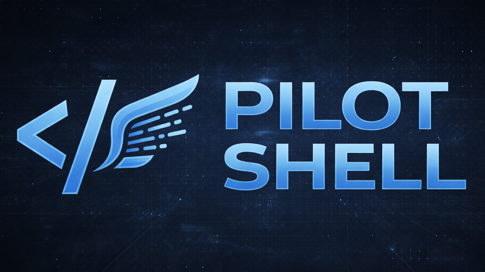
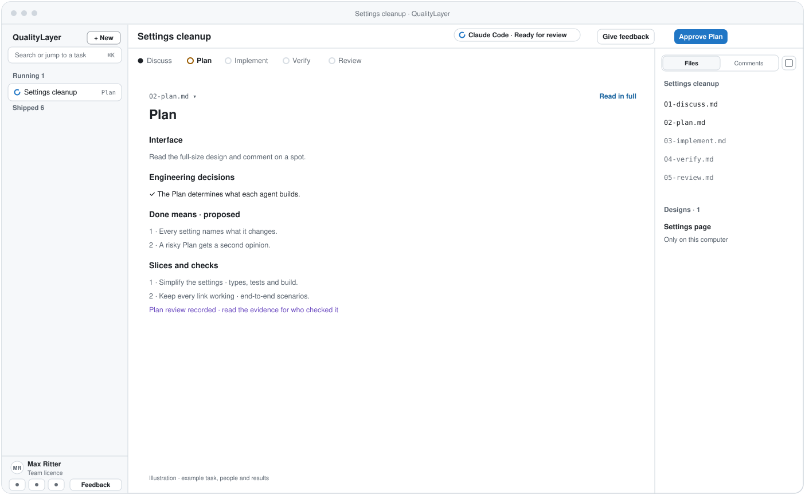
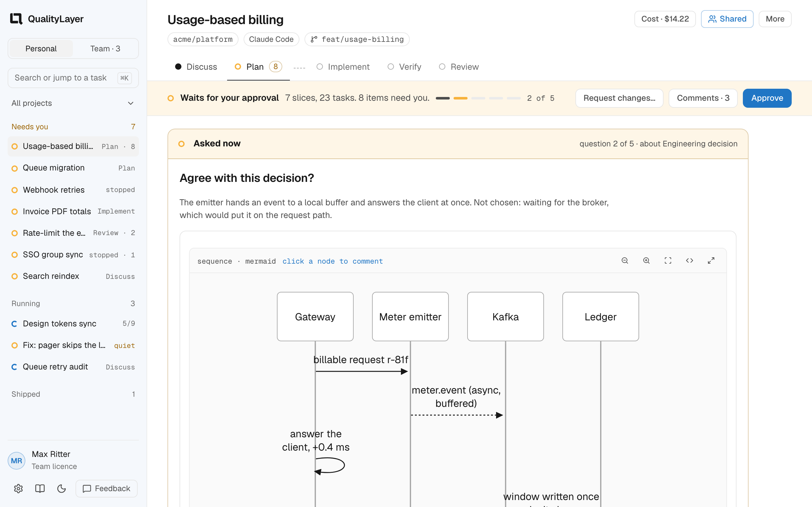

<div align="center">



# QualityLayer

### The software factory for your coding agents

You approve one plan before any code is written. Your agent builds it test first.<br>
**Then agents that did not write the code check the result against your request.**

[](https://github.com/maxritter/pilot-shell)
[](https://star-history.com/#maxritter/pilot-shell&Date)
[](https://github.com/maxritter/pilot-shell/releases)
[](https://github.com/maxritter/pilot-shell/pulls)

<p>
  <a href="#install">Install</a> •
  <a href="#why">Why</a> •
  <a href="#how">How it works</a> •
  <a href="#team">Teams</a> •
  <a href="https://qualitylayer.dev/docs/">Docs</a> •
  <a href="https://qualitylayer.dev">Website</a> •
  <a href="https://github.com/maxritter/pilot-shell/releases">Changelog</a>
</p>

**[Download the App](https://qualitylayer.dev/download)** for macOS, Windows or Linux. On a server, in WSL or in a container:

```bash
curl -fsSL https://qualitylayer.dev/install.sh | bash
```

**For Claude Code and Codex · terminal, desktop app or IDE · 7-day trial**

</div>

---

<h2 id="why">Why QualityLayer</h2>

**Coding agents write code fast, but even the best models don't keep a codebase healthy on their own.** Every change passes its tests and still leaves something behind: a copy, a workaround, code nobody reads. Over months, the codebase drifts into something nobody can safely change. Good software still needs people deciding what gets built, before the code exists.

**QualityLayer works inside the agent you already use.** Claude Code or Codex does the work in the terminal, its desktop app or your IDE, and asks you each decision there. The QualityLayer App shows what each question is about:

- **One plan before any code:** the mockup and each engineering decision as a diagram you can comment on. Then the slices, and the scenarios that prove the change works.
- **One question at a time:** your agent asks each decision of the plan in its own window, with its recommendation. The last question is the approval of the plan.
- **Built test first:** every task starts with a failing test, and QualityLayer records every test run itself.
- **No waiting while it builds:** when something does not go as planned, your agent takes the recommended way and lists it for you to read afterwards.
- **Checked for you:** agents that did not write the code check every point of your request against the running program. You watch a live checklist and can open the evidence.
- **Only what needs you:** what an agent can check folds into one line of proof, and what only you can confirm is asked at the end.
- **Your team, early:** teammates answer questions about the plan while it is still cheap to change, with their own agent if they like.
- **You stay in charge of cost:** pick the models, and see the time and estimated cost of every step.

QualityLayer is for medium and large changes. When a request is too small for a plan, your agent writes a ready prompt for the plain agent instead.

### From Pilot Shell to QualityLayer

Pilot Shell replaced much of the setup around your agent with its own hooks, rules and tools. Today's models work best with the tools their makers ship, so QualityLayer leaves those alone. It keeps what made Pilot Shell worth using and puts it on top of Claude Code and Codex, or any agent that runs shell commands: one plan you approve, a recorded build, an independent check, and your team in the loop.

---

<h2 id="install">Getting started</h2>

### What you need

**A coding agent.** The App sets up Claude Code and Codex for you. Any other agent that runs shell commands works too: [how to connect it](https://qualitylayer.dev/docs/agents/other).

- **Claude Code:** install with the [native installer](https://code.claude.com/docs/en/quickstart); remove an `npm` or `brew` copy first. Needs a Claude subscription: [Max 5x or 20x](https://claude.com/pricing) for one developer, [Team Premium](https://claude.com/pricing) or [Enterprise](https://claude.com/pricing) for a company.
- **Codex:** install the [Codex CLI](https://developers.openai.com/codex/cli). Needs an OpenAI subscription: [Plus or Pro](https://developers.openai.com/codex/pricing) for one developer, [Business or Enterprise](https://developers.openai.com/codex/pricing) for a company.

Start your agent once before you install, so its folder (`~/.claude` or `~/.codex`) exists.

### Install

One rule: a machine with a screen gets the App; one without gets the command line and opens the App in a browser.

| Machine | Install | Updates |
| --- | --- | --- |
| macOS (Intel, Apple silicon), Windows, Linux desktop | [Download the App](https://qualitylayer.dev/download) and open it. Its first start sets up the command line, your agents and your licence. The terminal installer below does the same and fetches the App. | The App updates itself and its command line together. It checks daily, downloads in the background and shows **Update ready** in the sidebar, with the release notes; on Windows it waits for running agent commands. `qualitylayer update` hands over to the App. |
| WSL2 | The terminal installer inside WSL: command line only. Links open in your Windows browser. | `qualitylayer update` |
| VS Code dev container | The terminal installer in the container: command line only. VS Code forwards the printed link. | `qualitylayer update` |
| Linux server | The terminal installer over SSH: command line only. Forward the port and open the printed link; you pair once, and links carry no key. | `qualitylayer update` |
| Pilot Shell 11, any of the above | Nothing to do: Pilot Shell's updater runs the installer, which moves the machine over by the same rule. | As above |

The terminal installer:

```bash
curl -fsSL https://qualitylayer.dev/install.sh | bash      # macOS, Linux, WSL
irm https://qualitylayer.dev/install.ps1 | iex             # Windows PowerShell
```

<details>
<summary><b>What gets installed</b></summary>

The installer downloads the binary for your platform, checks its SHA-256 checksum, then runs `qualitylayer install`, which adds:

- the binary in `~/.qualitylayer/bin/` (on Windows `%USERPROFILE%\.qualitylayer\bin\qualitylayer.exe`, with a `ql.cmd` shortcut)
- the `ql` skill for Claude Code and Codex, which their desktop apps and IDE extensions use too
- the `ql-peers` skill, so agent sessions can message each other
- Codex metadata so the skill runs only when you call it
- a `qualitylayer` link in `~/.local/bin` when that folder is on your `PATH`

It leaves your shell profile alone and adds no MCP server. It turns on the few agent settings QualityLayer needs, only where they are missing, and lists each one it changes. These are high reasoning effort, Claude Code's task tools, Codex's plan tool and option picker and, when Codex knows your model's limits, its largest context window. A value you already set stays as it is.

Claude Code also gets a band above the prompt that says what the agent asks next, such as `QL · Settings cleanup · Plan · the agent asks next: Approve the Plan?`. QualityLayer sets no status line, so yours stays as it is.

Prompt and picker hooks record your answers from your agent's chat, including the approval of a plan. Session hooks attach agent messaging. The installer records these additions so uninstall can remove them while keeping your own configuration.

</details>

<details>
<summary><b>Update, uninstall and older versions</b></summary>

```bash
qualitylayer update               # on a desktop, hands over to the App
qualitylayer uninstall            # remove exactly what install added
qualitylayer uninstall --purge    # … and the licence and task state
curl -fsSL https://qualitylayer.dev/install.sh | VERSION=12.0.0-beta.1 bash   # a specific release
```

Plans in your repositories stay. Earlier releases are on the [releases page](https://github.com/maxritter/pilot-shell/releases).

</details>

<details>
<summary><b>Coming from Pilot Shell 11</b></summary>

Pilot Shell's updater moves you over, and so does opening the App or running the terminal installer. The move asks nothing: Pilot Shell's own hooks, rules and settings go; the tools it installed and its memories stay, and the report says how to remove them. Your plans carry over, and a paid licence keeps working; without one, your 7-day trial starts.

</details>

### Your first task

Describe a change to your agent in any repository:

```text
/ql retry failed webhooks, and stop after a few tries     # Claude Code
$ql retry failed webhooks, and stop after a few tries     # Codex
```

Your agent asks each decision in the terminal, and the App beside it shows only what the current question is about. Put the App on the left and the terminal on the right. The App folds the rest and records each answer as "answered in the chat". The last question, "Approve the Plan?", you answer in the terminal or with the App's Approve button. `qualitylayer app` opens the App any time.

After you approve, the App opens Implement with one command that starts the build, such as `claude --model sonnet --effort high "/goal /ql implement retry-webhooks"`. From there nothing waits for you until the final review.

QualityLayer runs only when you ask for it: with `/ql` (`$ql` in Codex), `/ql implement`, or a request to resume a named task. Everything else works as before.

<details>
<summary><b>Privacy</b></summary>

Plans are files in your repository, and the App runs on your computer. A few anonymous events go out with the daily licence check, such as a task started or shipped, a step entered or a check result. Never a repository name, path, branch, title or text. Turn them off in Settings, with `qualitylayer telemetry off`, or with `DO_NOT_TRACK=1`.

Feedback is sent only when you press Send feedback. It becomes one issue in a private repository, with your text, the screenshots you add and diagnostics you can read first. Never code, plan or document text, task titles, repository or branch names, or file paths.

</details>

---

<h2 id="how">How it works</h2>

### Five steps from request to pull request

Every task takes the same five steps. You decide twice: when you approve the plan, and when you approve the finished change.

<picture>
  <source media="(prefers-color-scheme: dark)" srcset="docs/docusaurus/static/img/diagrams/flow-dark.svg">
  
</picture>

- **Discuss:** your agent reads the code and asks one question at a time in its own window, each with its recommendation. The App shows what the question is about and what done means. A bug is reproduced and its cause found first.
- **Plan:** the mockup and each engineering decision as a diagram, then the slices and the scenarios that prove the change works. A second agent reads the plan before it reaches you. Your agent asks each decision in the terminal and the App shows its diagram. Then it asks "Approve the Plan?".
- **Implement:** the App opens with one command that starts the build, with the model and effort it recommends. Every task starts with a failing test. Nothing waits for you: when something does not go as planned, your agent takes the recommended way and the App lists it under "Changed while building".
- **Verify:** polish and, across a trust boundary, a security review, then agents that did not write the code check every point of your request, on a live checklist.
- **Review:** your agent asks the few items left in the terminal, and you look at the result in the App and approve. The Approve menu can open the pull request.

QualityLayer works on the branch and worktree you have checked out and never switches them.

### Built test first, checked by other agents

QualityLayer records every test run itself, with its exit code, so a passing claim always has a run behind it. A slice the plan marks risky gets a checkpoint: its scenarios run on the real program. A failure goes to an agent to fix and never stops the build. Whatever stays open reaches the final review.

<picture>
  <source media="(prefers-color-scheme: dark)" srcset="docs/docusaurus/static/img/diagrams/slices-dark.svg">
  
</picture>

While agents check, every check is listed from the start and fills in live.

<picture>
  <source media="(prefers-color-scheme: dark)" srcset="docs/docusaurus/static/img/diagrams/screen-verify-dark.png">
  
</picture>

### The models you choose, the cost you can see

You plan with your best model in your own session; Opus 5.5 is recommended for Discuss and Plan. Workers build on a smaller model, Sonnet 5.5 by default, and start from the written plan, so none of them needs your chat history.

<picture>
  <source media="(prefers-color-scheme: dark)" srcset="docs/docusaurus/static/img/diagrams/agents-dark.svg">
  
</picture>

Settings keeps it short. Pick the model of the workers and of the checking agents, or no subagents at all. Pick the model of the second opinion, which another vendor's AI gives by itself on risky plans. The App shows the time, tokens and estimated cost of every step, with each agent named after its work.

---

<h2 id="app">The QualityLayer App</h2>

The App is where you read and look, on macOS, Windows and Linux. It shows the plan and its diagrams and the evidence, takes a comment on anything the agent did not ask about, and mirrors your answers. Every step has the same four layers: whose turn it is, the items that need you, one line of what agents checked, and the work itself. Close it, and your tasks keep running: a notification, and the band in Claude Code, tell you when something needs you.

<picture>
  <source media="(prefers-color-scheme: dark)" srcset="docs/docusaurus/static/img/diagrams/app-dark.svg">
  
</picture>

A Plan with its first item, the mockup, and its two answers.

<picture>
  <source media="(prefers-color-scheme: dark)" srcset="docs/docusaurus/static/img/diagrams/screen-plan-dark.png">
  
</picture>

Each item has its own two answers, in the terminal as in the App. Agree or change a decision. Looks right, or change a mockup. Confirm what only you can confirm. Accept or fix a finding.

<picture>
  <source media="(prefers-color-scheme: dark)" srcset="docs/docusaurus/static/img/diagrams/items-dark.svg">
  
</picture>

Your agent asks each item in the terminal and the App records the answer. The App never starts, pauses or stops an agent. After you approve the plan, it opens Implement with the recommended setup, four rows to adjust it and one command to copy.

<picture>
  <source media="(prefers-color-scheme: dark)" srcset="docs/docusaurus/static/img/diagrams/implement-start-dark.svg">
  
</picture>

Updates arrive quietly: the App checks once a day, downloads in the background and shows an Update ready line with the release notes. Feedback is one click in the sidebar.

---

<h2 id="team">Bring your team in</h2>

With a Team plan, teammates help shape the plan and review the change, each from their own App. Working on your own is just as complete: every feature above works without a team.

**Ask while it is still a plan.** Pick a passage, a diagram, a section or the whole plan, and choose who to ask. They get a Slack message that opens the question in their App, and answer with looks right, a suggested change, or a reply. You get a message when they answer. The answer goes straight to your agent; you decide.

<picture>
  <source media="(prefers-color-scheme: dark)" srcset="docs/docusaurus/static/img/diagrams/team-dark.svg">
  
</picture>

**Answer with your own agent.** A teammate can hand the question to their own coding agent with `/ql answer`. It reads the plan and their code, asks them what it needs, and drafts the answer. Nothing is sent without their yes, and the answer shows which agent wrote it.

<picture>
  <source media="(prefers-color-scheme: dark)" srcset="docs/docusaurus/static/img/diagrams/team-agents-dark.svg">
  
</picture>

**Review the change together.** After the build, teammates comment on any line of the finished change, with its proof. Their comments go back to your agent. The code itself is reviewed in your pull request, as always.

<picture>
  <source media="(prefers-color-scheme: dark)" srcset="docs/docusaurus/static/img/diagrams/team-change-dark.svg">
  
</picture>

The Team space lists the questions waiting for you first, then your questions to others, with a reminder at most every four hours, and what each teammate is working on. People outside the team read and comment through a link, without an account; they cannot approve. Sharing sends the plan and its progress, encrypted on your machine, and never your code.

### Agent sessions that message each other

Claude Code and Codex sessions on your computer can message each other: Claude to Claude, Codex to Codex, or across. One can ask another for a review, hand over a task, or talk a problem through.

<picture>
  <source media="(prefers-color-scheme: dark)" srcset="docs/docusaurus/static/img/diagrams/peers-dark.svg">
  
</picture>

---

## Videos

Two films show it: an overview, and every step in the App. Watch them on the [website](https://qualitylayer.dev/#films), or [scroll through a whole task](https://qualitylayer.dev/#tour).

---

## Documentation

- [Install](https://qualitylayer.dev/docs/install), [how to connect another coding agent](https://qualitylayer.dev/docs/agents/other), [your first task](https://qualitylayer.dev/docs/first-task), [updates and release notes](https://qualitylayer.dev/docs/updating) and [moving from Pilot Shell 11](https://qualitylayer.dev/docs/moving-from-pilot-shell)
- The five steps: [Discuss](https://qualitylayer.dev/docs/steps/discuss), [Plan](https://qualitylayer.dev/docs/steps/plan), [Implement](https://qualitylayer.dev/docs/steps/implement), [Verify](https://qualitylayer.dev/docs/steps/verify), [Review](https://qualitylayer.dev/docs/steps/review)
- [The App](https://qualitylayer.dev/docs/app), [team plans](https://qualitylayer.dev/docs/team/plans), [teammates' agents](https://qualitylayer.dev/docs/team/agents) and [change review](https://qualitylayer.dev/docs/team/changes)
- [Commands](https://qualitylayer.dev/docs/reference/commands), [settings](https://qualitylayer.dev/docs/reference/settings), and [files and privacy](https://qualitylayer.dev/docs/reference/files)

## Changelog

See [the changelog](https://qualitylayer.dev/docs/changelog) or [GitHub Releases](https://github.com/maxritter/pilot-shell/releases).

## Contributing

Found a bug or missing a feature? [Open an issue](https://github.com/maxritter/pilot-shell/issues).

## License

See [LICENSE](LICENSE).

---

<div align="center">

**The software factory for your coding agents**

Made by [Max Ritter](https://maxritter.net)

</div>

[osai-verify: 8d67182dee08d42091c5]: #
