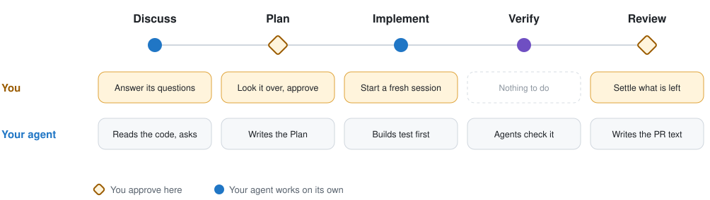
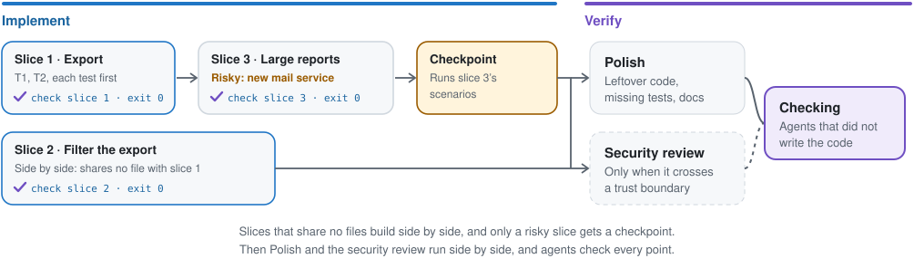
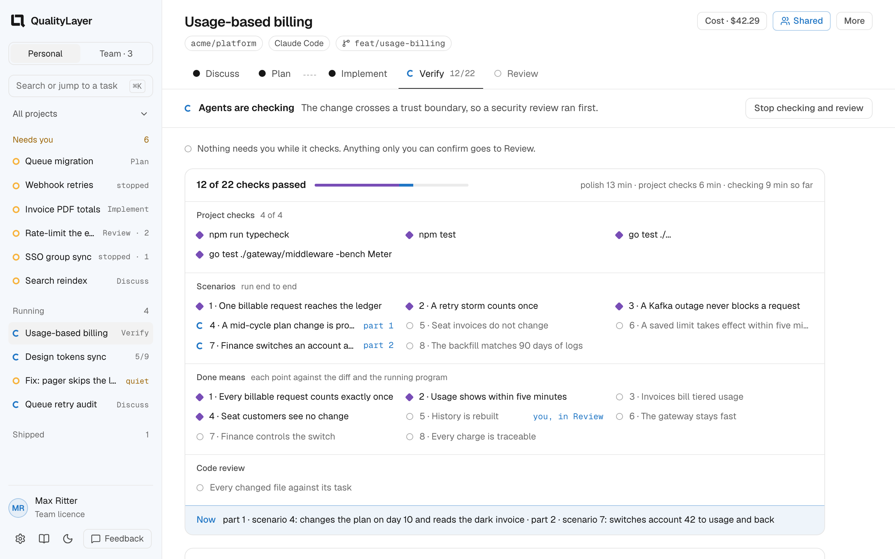
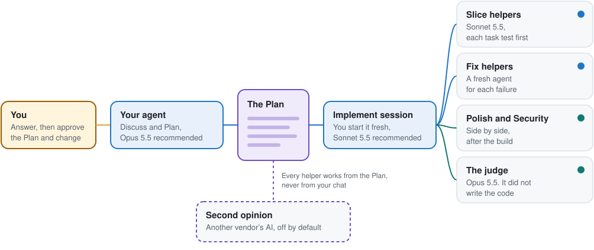
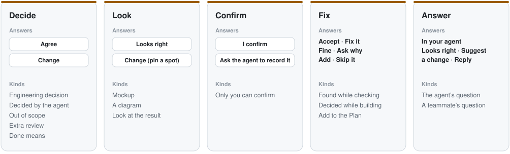
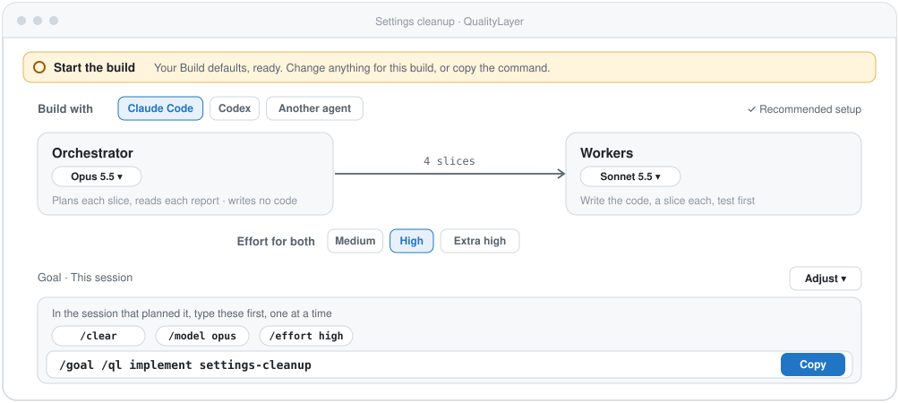
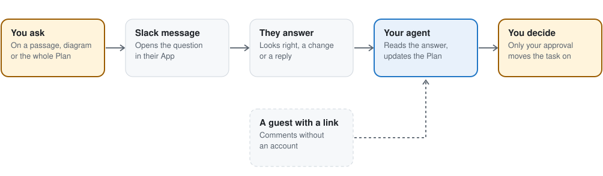
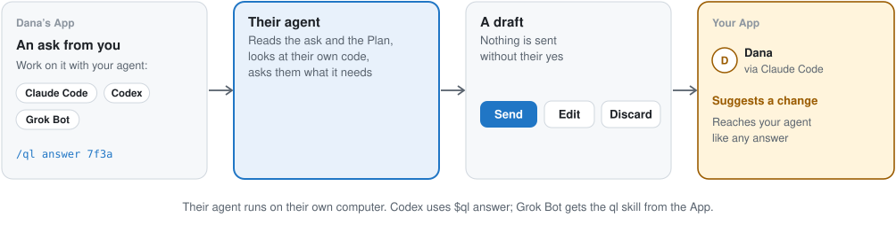
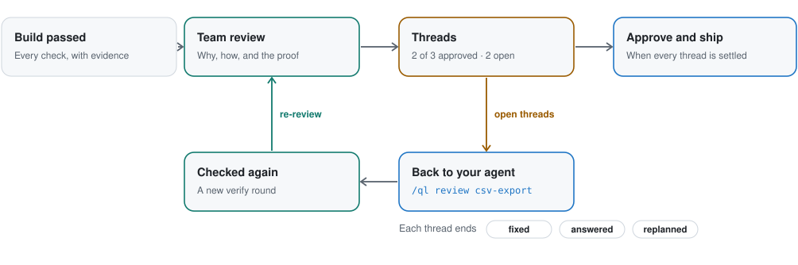
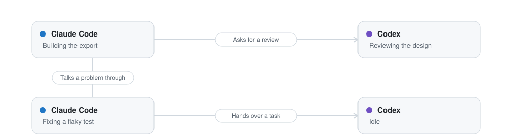

<div align="center">

<picture>
  <source media="(prefers-color-scheme: dark)" srcset="docs/site/public/brand/qualitylayer-mark.svg">
  
</picture>

# QualityLayer

### The software factory for your coding agents

You approve one plan before any code is written. Your agent builds it test first.<br>
**Then agents that did not write the code check the result against your request.**

<a href="https://github.com/maxritter/pilot-shell"><picture>
  <source media="(prefers-color-scheme: dark)" srcset="https://img.shields.io/github/stars/maxritter/pilot-shell?style=flat&amp;color=9d6607&amp;labelColor=30363d">
  
</picture></a>
<a href="https://star-history.com/#maxritter/pilot-shell&amp;Date"><picture>
  <source media="(prefers-color-scheme: dark)" srcset="https://img.shields.io/badge/Star_History-chart-6f4fc2?labelColor=30363d">
  
</picture></a>
<a href="https://github.com/maxritter/pilot-shell/releases"><picture>
  <source media="(prefers-color-scheme: dark)" srcset="https://img.shields.io/github/downloads/maxritter/pilot-shell/total?color=2076c5&amp;labelColor=30363d">
  
</picture></a>
<a href="https://github.com/maxritter/pilot-shell/pulls"><picture>
  <source media="(prefers-color-scheme: dark)" srcset="https://img.shields.io/badge/PRs-welcome-2076C5.svg?labelColor=30363d">
  
</picture></a>

<p>
  <a href="#install">Install</a> •
  <a href="#why">Why</a> •
  <a href="#how">How it works</a> •
  <a href="#team">Teams</a> •
  <a href="https://qualitylayer.dev/docs/">Docs</a> •
  <a href="https://qualitylayer.dev">Website</a> •
  <a href="https://github.com/maxritter/pilot-shell/releases">Changelog</a>
</p>

**[Download the App](https://qualitylayer.dev/download)** for macOS, Windows or Linux. On a server, in WSL or in a container:

```bash
curl -fsSL https://qualitylayer.dev/install.sh | bash
```

**For Claude Code and Codex · terminal, desktop app or IDE · 7-day trial**

</div>

---

> [!TIP]
> **QualityLayer's open design companion:** [Open Claude Design](https://github.com/maxritter/open-claude-design) connects Claude Design to the coding agent you already use, with codebase-grounded creation and conflict-aware synchronization. Together with [Impeccable](https://github.com/pbakaus/impeccable), product context, visual iteration, deterministic checks, and engineering verification work as one design layer.

---

<h2 id="why">Why QualityLayer</h2>

**Coding agents write code fast, but even the best models don't keep a codebase healthy on their own.** Every change passes its tests and still leaves something behind: a copy, a workaround, code nobody reads. Over months, the codebase drifts into something nobody can safely change. Good software still needs people deciding what gets built, before the code exists.

**QualityLayer works inside the agent you already use.** Claude Code or Codex does the work in the terminal, its desktop app or your IDE. You answer in the QualityLayer App, which shows what each question is about:

- **One plan before any code:** the design and each engineering decision as a diagram you can comment on. Then the slices, and the scenarios that prove the change works.
- **One focused question:** independent questions can arrive together in a batch. **Your turn** shows one with its context, a visible field for your own answer and **Send**. Skip for now to answer another first; each answer reaches the agent immediately. Approving the plan is a separate action.
- **Designs on your computer:** ask your agent to draw a page, open it full size in the App, and point at what should change. The interactive page and its comments stay local; a share link can show a still of the Plan's design.
- **Built test first:** every task starts with a failing test, and QualityLayer records every test run itself.
- **Routine decisions handled:** your agent takes the recommended way and records it. If it needs a login or secret, you provide it while other slices keep building.
- **Checked for you:** agents that did not write the code check every point of your request against the running program. You watch a live checklist and can open the evidence.
- **Your turn:** questions and approvals wait in one card. Each Done means point keeps its proof beside it, and Review asks what only you can confirm.
- **Your team, early:** teammates answer questions about the plan while it is still cheap to change, with their own agent if they like.
- **You stay in charge of cost:** pick the models, and see the time and estimated cost of every step.

QualityLayer is for medium and large changes. Every new request starts as a named task in Discuss. For a change too small for a plan, your agent keeps that document and closes the task with a ready prompt for the plain agent.

### From Pilot Shell to QualityLayer

Pilot Shell replaced much of the setup around your agent with its own hooks, rules and tools. QualityLayer keeps the tools that Claude Code and Codex ship. It adds a plan you approve, a recorded build, an independent check, and your team in the loop. Any agent that runs shell commands can follow the same flow.

---

<h2 id="install">Getting started</h2>

### What you need

**A coding agent.** The App sets up Claude Code and Codex for you. Any other agent that runs shell commands works too: [how to connect it](https://qualitylayer.dev/docs/agents/other).

- **Claude Code:** install with the [native installer](https://code.claude.com/docs/en/quickstart); remove an `npm` or `brew` copy first. Needs a Claude subscription: [Max 5x or 20x](https://claude.com/pricing) for one developer, [Team Premium](https://claude.com/pricing) or [Enterprise](https://claude.com/pricing) for a company.
- **Codex:** install the [Codex CLI](https://developers.openai.com/codex/cli). Needs an OpenAI subscription: [Plus or Pro](https://developers.openai.com/codex/pricing) for one developer, [Business or Enterprise](https://developers.openai.com/codex/pricing) for a company.

Start your agent once before you install, so its folder (`~/.claude` or `~/.codex`) exists.

### Install

One rule: a machine with a screen gets the App; one without gets the command line and opens the App in a browser.

| Machine | Install | Updates |
| --- | --- | --- |
| macOS (Intel, Apple silicon), Windows, Linux desktop | [Download the App](https://qualitylayer.dev/download) and open it. Its first start sets up the command line, your agents and your licence. The terminal installer below does the same and fetches the App. | The App updates itself and its command line together. It checks daily, downloads in the background and shows **Update ready** in the sidebar, with the release notes; on Windows it waits for running agent commands. `qualitylayer update` hands over to the App. |
| WSL2 | The terminal installer inside WSL: command line only. Links open in your Windows browser. | `qualitylayer update` |
| VS Code dev container | The terminal installer in the container: command line only. VS Code forwards the printed link. | `qualitylayer update` |
| Linux server | The terminal installer over SSH: command line only. Forward the port and open the printed link; you pair once, and links carry no key. | `qualitylayer update` |
| Pilot Shell 11, any of the above | Nothing to do: Pilot Shell's updater runs the installer, which moves the machine over by the same rule. | As above |

The terminal installer:

```bash
curl -fsSL https://qualitylayer.dev/install.sh | bash      # macOS, Linux, WSL
irm https://qualitylayer.dev/install.ps1 | iex             # Windows PowerShell
```

<details>
<summary><b>What gets installed</b></summary>

The installer downloads the binary for your platform, checks its SHA-256 checksum, then runs `qualitylayer install`, which adds:

- the binary in `~/.qualitylayer/bin/` (on Windows `%USERPROFILE%\.qualitylayer\bin\qualitylayer.exe`, with a `ql.cmd` shortcut)
- the `ql` skill for Claude Code and Codex, which their desktop apps and IDE extensions use too
- the `agent-peers` skill, so agent sessions can message each other
- Codex metadata so the skill runs only when you call it
- a `qualitylayer` link in `~/.local/bin` when that folder is on your `PATH`

`/ql` is the only command you need: QualityLayer adds no other command that starts with ql. The `agent-peers` skill works on its own when you ask one agent session to message another.

It leaves your shell profile alone and adds no MCP server. It turns on the few agent settings QualityLayer needs, only where they are missing, and lists each one it changes. These are high reasoning effort, Claude Code's task tools, Codex's plan tool and, when Codex knows your model's limits, its largest context window. A value you already set stays as it is.

Claude Code also gets a band above the prompt while a review waits for you. `/task-pane` opens the steps and build progress beside your conversation. QualityLayer sets no status line, so yours stays as it is.

A few hooks keep each session's App status current and direct a running build's questions to the App. They also record an approval you type in the agent's chat. Session hooks attach agent messaging. The installer records these additions so uninstall can remove them while keeping your own configuration.

</details>

<details>
<summary><b>Update, uninstall and older versions</b></summary>

```bash
qualitylayer update               # on a desktop, hands over to the App
qualitylayer uninstall            # remove exactly what install added
qualitylayer uninstall --purge    # … and the licence and task state
curl -fsSL https://qualitylayer.dev/install.sh | VERSION=12.0.0-beta.1 bash   # a specific release
```

Plans in your repositories stay. Earlier releases are on the [releases page](https://github.com/maxritter/pilot-shell/releases).

</details>

<details>
<summary><b>Coming from Pilot Shell 11</b></summary>

Pilot Shell's updater moves you over, and so does opening the App or running the terminal installer. The move asks nothing: Pilot Shell's own hooks, rules and settings go; the tools it installed and its memories stay, and the report says how to remove them. Your plans carry over, and a paid licence keeps working; without one, your 7-day trial starts.

</details>

### Your first task

Describe a change to your agent in any repository:

```text
/ql retry failed webhooks, and stop after a few tries     # Claude Code
$ql retry failed webhooks, and stop after a few tries     # Codex
```

Or click **+ New** in the App: say what you want, pick the model, the effort and where it starts, and copy one command. Your agent asks each decision in the App, and its terminal shows a single line while it waits. **Your turn** shows one question with its context: click a choice, type in **Your own answer** and press **Send**, or ask it to tell you more. **Skip for now** lets you answer another question first. Each answer goes to the agent immediately. Read the complete Plan, settle its decisions, then approve it. `qualitylayer app` opens the App any time.

After you approve, Implement opens with your Build defaults and one command that starts the build in a fresh session, such as `claude --model opus --effort high "/ql implement retry-webhooks"`. From there your agent works on its own until the final review.

QualityLayer runs only when you ask for it: with `/ql` (`$ql` in Codex), `/ql implement`, or a request to resume a named task. Everything else works as before.

<details>
<summary><b>Privacy</b></summary>

Plans are files in your repository, and the App runs on your computer. QualityLayer sends no usage events. It contacts QualityLayer for your licence, the workflow texts your agent follows and updates. Optional sharing encrypts the reached steps' readable documents and comments on this computer before sending them. Your code, diff, agent records and interactive design pages stay local. A shared Plan may include a labelled raster still of its design. See [files and privacy](https://qualitylayer.dev/docs/reference/files#privacy).

Feedback is sent only when you press Send feedback. It becomes one issue in a private repository, with your text, the screenshots you add and diagnostics you can read first. Never code, plan or document text, task titles, repository or branch names, or file paths.

</details>

---

<h2 id="how">How it works</h2>

### Five steps from request to pull request

Every task takes the same five steps. You approve twice: the plan before any code, and the finished change.

<picture>
  <source media="(prefers-color-scheme: dark)" srcset="docs/docusaurus/static/img/diagrams/flow-dark.svg">
  
</picture>

- **Discuss:** your agent reads the code and asks independent questions, each with its recommendation. **Your turn** shows one focused question; answer in any order with **Skip for now**. The page records each answer immediately. Agree to each **Done means** point separately. A bug is reproduced and its cause found first.
- **Plan:** read the design, diagrams, slices and checks full size, with comments beside them. The App shows the recorded Plan reviews. Settle its decisions in **Your turn**, then approve it. If a Done means point changes, only that point needs your agreement again.
- **Implement:** the App opens with your Build defaults and one command that starts the build: an orchestrator that writes no code, and workers that build the slices. **Build** shows the slices, changes and checks. Routine decisions appear under "Decided while building". A login or secret only you can provide appears in **Your turn**; other slices keep building.
- **Verify:** polish and, across a trust boundary, a security review, then agents that did not write the code check every point of your request, on a live checklist.
- **Review:** read the result and proof under each **Done means** point. Settle the remaining questions in **Your turn**, then approve the change. The pull request opens with its proof.

Each step is one Markdown file in the task's folder, from `01-discuss.md` to `05-review.md`, written for you; the agents' own records go to `agent/`. On GitHub the files read as plain Markdown.

QualityLayer works on the branch and worktree you have checked out and never switches them.

### Built test first, checked by other agents

QualityLayer records every test run itself, with its exit code, so a passing claim always has a run behind it. A slice the plan marks risky gets a checkpoint: its scenarios run on the real program. A failure goes to an agent to fix and never stops the build. Whatever stays open reaches the final review.

<picture>
  <source media="(prefers-color-scheme: dark)" srcset="docs/docusaurus/static/img/diagrams/slices-dark.svg">
  
</picture>

While agents check, every **Done means** point keeps its checks and evidence together. Their live status shows what is being checked now.

<picture>
  <source media="(prefers-color-scheme: dark)" srcset="docs/docusaurus/static/img/diagrams/screen-verify-dark.png">
  
</picture>

### The models you choose, the cost you can see

You plan with your best model; Opus 5.5 is the default for Discuss and Plan, and Fable 5.1 can plan and orchestrate too. Workers build on a smaller model, Sonnet 5.5 by default, and start from the written plan, so none of them needs your chat history.

<picture>
  <source media="(prefers-color-scheme: dark)" srcset="docs/docusaurus/static/img/diagrams/agents-dark.svg">
  
</picture>

Planning defaults and Build defaults set the model, effort and where each session starts for Claude Code and Codex. You can plan with one and build with the other. Independent review selects the model that checks whether the finished change passes. A second opinion comes from the other coding agent on risky plans. The App shows each step's time, tokens and estimated cost, with each agent named after its work.

---

<h2 id="app">The QualityLayer App</h2>

The App is where you answer, read and comment, on macOS, Windows and Linux. **Your turn** shows one focused question or decision with the context it needs. The top bar names the agent; **Agent status** opens its current work and whether it is waiting, quiet or stopped. The dollar amount opens the estimated cost, with unpriced tokens shown as muted detail.

The right sidebar holds **Files** and **Comments**. Files lists the five documents and compact designs. Discuss and Plan offer the complete document for reading, with folded decision lists. Before Plan approval, full reading opens with its outline and comments within reach. The file chip and menu in the document header open the agent's version and records in a read-only reader. Implement shows **Build**, with its written record available from Files. Home shows what needs you, what is running, and what shipped, with time and estimated cost when available. Close the App, and your tasks keep running.

Each item has its own two answers. Agree or change a decision. Looks right, or change a design. Confirm what only you can confirm. Accept or fix a finding.

<picture>
  <source media="(prefers-color-scheme: dark)" srcset="docs/docusaurus/static/img/diagrams/items-dark.svg">
  
</picture>

Each answer goes to your agent at once and leaves **Your turn**. Write in the visible **Your own answer** field and press **Send**. Discuss keeps earlier answers under the folded **Decided with you** history, where **Change** corrects them while that step remains open. The agent keeps working on anything that does not depend on an open answer. After you approve the plan, Implement opens with your Build defaults: the orchestrator, its workers, one effort for both, and one command to copy. See [answering questions and shortcuts](https://qualitylayer.dev/docs/app#questions).

<picture>
  <source media="(prefers-color-scheme: dark)" srcset="docs/docusaurus/static/img/diagrams/implement-start-dark.svg">
  
</picture>

**Designs.** Ask your agent to "mock up the settings page" and it draws one HTML page in your project. The App lists it as a compact entry in **Files**, opens it full size, and takes a comment on any spot. The agent changes the same page and says in one line what changed. The interactive page and its comments stay on your computer; an explicitly shared Plan can include a labelled raster still.

Updates arrive quietly: the App checks once a day, downloads in the background and shows an Update ready line with the release notes. Feedback is one click in the sidebar.

---

<h2 id="team">Bring your team in</h2>

With a Team plan, teammates help shape the plan and review the change, each from their own App. Working on your own is just as complete: every feature above works without a team.

**Ask while it is still a plan.** Pick a passage, a diagram, a section or the whole plan, and choose who to ask. They get a Slack message that opens the question in their App, and answer with looks right, a suggested change, or a reply. You get a message when they answer. The answer goes straight to your agent; you decide.

<picture>
  <source media="(prefers-color-scheme: dark)" srcset="docs/docusaurus/static/img/diagrams/team-dark.svg">
  
</picture>

**Answer with your own agent.** A teammate can hand the question to their own coding agent with `/ql answer`. It reads the plan and their code, asks them what it needs, and drafts the answer. Nothing is sent without their yes, and the answer shows which agent wrote it.

<picture>
  <source media="(prefers-color-scheme: dark)" srcset="docs/docusaurus/static/img/diagrams/team-agents-dark.svg">
  
</picture>

**Review the change together.** After the build, teammates comment on any line of the finished change, with its proof. Their comments go back to your agent. The code itself is reviewed in your pull request, as always.

<picture>
  <source media="(prefers-color-scheme: dark)" srcset="docs/docusaurus/static/img/diagrams/team-change-dark.svg">
  
</picture>

The Team space lists the questions waiting for you first, then your questions to others, with a reminder at most every four hours, and what each teammate is working on. People outside the team read and comment through a link, without an account; they cannot approve. The link always shows the task as it stands, with the time it was last updated. Sharing sends the plan and its progress, encrypted on your machine. Links can include a still of the Plan's design; your code and the interactive design page stay local.

### Agent sessions that message each other

Claude Code and Codex sessions on your computer can message each other: Claude to Claude, Codex to Codex, or across. One can ask another for a review, hand over a task, or talk a problem through.

<picture>
  <source media="(prefers-color-scheme: dark)" srcset="docs/docusaurus/static/img/diagrams/peers-dark.svg">
  
</picture>

---

## Videos

Two films show it: an overview, and every step in the App. Watch them on the [website](https://qualitylayer.dev/#films), or [scroll through a whole task](https://qualitylayer.dev/#tour).

---

## Documentation

- [Install](https://qualitylayer.dev/docs/install) (with [updates](https://qualitylayer.dev/docs/install#updates)), [your first task](https://qualitylayer.dev/docs/first-task), [other agents](https://qualitylayer.dev/docs/agents/other) and [moving from Pilot Shell 11](https://qualitylayer.dev/docs/moving-from-pilot-shell)
- The five steps: [Discuss](https://qualitylayer.dev/docs/steps/discuss), [Plan](https://qualitylayer.dev/docs/steps/plan), [Implement](https://qualitylayer.dev/docs/steps/implement), [Verify](https://qualitylayer.dev/docs/steps/verify), [Review](https://qualitylayer.dev/docs/steps/review)
- [The App](https://qualitylayer.dev/docs/app), [team plans](https://qualitylayer.dev/docs/team/plans), [teammates' agents](https://qualitylayer.dev/docs/team/agents) and [change review](https://qualitylayer.dev/docs/team/changes)
- [Commands](https://qualitylayer.dev/docs/reference/commands), [settings](https://qualitylayer.dev/docs/reference/settings), and [files and privacy](https://qualitylayer.dev/docs/reference/files)

## Changelog

See [the changelog](https://qualitylayer.dev/docs/changelog) or [GitHub Releases](https://github.com/maxritter/pilot-shell/releases).

## Contributing

Found a bug or missing a feature? [Open an issue](https://github.com/maxritter/pilot-shell/issues).

## License

See [LICENSE](LICENSE).

---

<div align="center">

**The software factory for your coding agents**

Made by [Max Ritter](https://maxritter.net)

</div>

[osai-verify: 8d67182dee08d42091c5]: #
